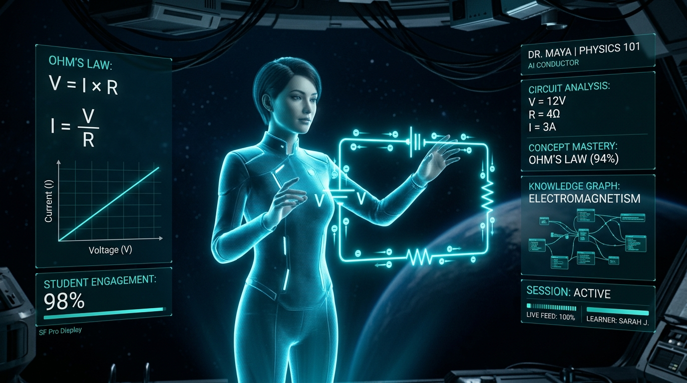

<div align="center">



# Teach-AI

**Don't just learn. Be taught.**

An adaptive AI teacher concept that turns a topic or study material into a personalized, video-and-voice guided lesson — built for the Bharat Academix AI Innovation Hackathon 2026.

[🚀 Live Demo](https://teach-ai-virid.vercel.app/) · [🎥 Demo Video](./AI%20Innovation%20Hackathon%202026%20Video.mp4) · [💻 Source Code](https://github.com/dk-khandelwal06)

</div>

---

## 🚀 Try Teach-AI

Experience the deployed application — no setup required.

**[Open Teach-AI →](https://teach-ai-virid.vercel.app/)**

---

## 🎥 Demo

Watch the complete Teach-AI walkthrough, including the teaching experience and the adaptive learning flow triggered by an intentionally wrong answer.

- [▶️ Watch the Demo Video](<./AI Innovation Hackathon 2026 Video.mp4>)
- [⬇️ Open / Download Demo Video](<./AI Innovation Hackathon 2026 Video.mp4>)

> GitHub does not reliably render inline `<video>` playback inside README files, so the links above open the actual MP4 committed to this repository (`AI Innovation Hackathon 2026 Video.mp4`) directly.

---

## Why Teach-AI?

Most learning tools fall into one of two buckets:

- **Static video courses** — if a learner holds a misconception, the video just keeps playing.
- **Generic chatbots** — they answer questions but never check whether the learner actually understood the *why*.

Teach-AI explores what a single AI-driven lesson could feel like if it behaved more like a 1-on-1 tutor: plan the lesson, teach it, ask a diagnostic question, catch a specific misconception, re-explain with a different analogy, and only then move on.

---

## 🧠 How It Works

```
Student
  ↓
Topic / Learning Material
  ↓
Learner Profile (level, language, time, goal, style)
  ↓
Lesson Planning
  ↓
AI Teaching (voice + animated avatar + visuals)
  ↓
Diagnostic Question
  ↓
Evaluation → Misconception Detected? → Adapted Re-explanation
  ↓
Final Assessment
  ↓
Learning Report & Feedback
```

---

## ✨ Key Features

**Implemented in this build:**

- **Guided onboarding flow** — pick or type a topic, optionally "upload" study material, and set a learner profile (level, language, available time, learning goal, teaching style).
- **AI Classroom experience** — a dedicated teaching view with a synchronized subtitle track, a live audio waveform, and a lesson timeline rail.
- **Procedural animated teacher avatar** — an HTML5 Canvas–driven avatar (blinking, breathing motion, expression states) that reacts to speaking/idle/adapting states.
- **Voice narration with karaoke-style subtitles** — powered by the browser's native Web Speech API (`SpeechSynthesis`), with word-boundary events driving subtitle highlighting.
- **Multilingual UI & narration** — English, Hindi (हिंदी), and Hinglish, with language-appropriate voice selection where the browser exposes one.
- **Interactive circuit simulator** — a canvas-based Ohm's Law circuit (voltage/resistance sliders, animated electron flow, ammeter, bulb brightness) as the "demonstrate" stage of the lesson.
- **Scripted misconception detection & adaptation** — the demo lesson recognizes one specific wrong-answer scenario (confusing direct vs. inverse proportionality between resistance and current), explains the flawed assumption, and switches to a hydraulic water-pipe analogy before re-testing.
- **RAG-style grounding drawer** — a keyword-scored retrieval view over a small local set of sample "textbook" chunks, showing section titles, page numbers, and relevance scores.
- **Final assessment & learning report** — a 5-question quiz feeding into a mastery radar chart, qualitative feedback (in all three supported languages), and a recommended next lesson.
- **Jury Presentation Mode** — a pinned navigation bar for judges to jump directly between the 7 stages of the flow, plus an automated 60-second guided walkthrough.

**Planned / Future Scope** (see below) — live LLM-generated lessons, real document parsing, and general-purpose (non-scripted) misconception detection.

---

## 🔄 The Teaching Loop

```
Understand → Plan → Explain → Demonstrate → Question → Evaluate → Adapt → Continue
```

Every stage is a distinct screen in the app rather than a single chat thread. The goal is to demonstrate what moving *beyond* simple question-answering could look like: a lesson that plans itself around the learner, teaches with voice and visuals, checks understanding with a real diagnostic question, and — when it detects a specific known misconception — adapts the explanation before letting the learner continue.

---

## 🎯 Personalized Learning

The learner profile captured during onboarding (`src/types/lesson.ts`) drives the lesson state and is implemented end-to-end in the UI:

- **Level** — beginner / intermediate / advanced
- **Language** — English / Hindi / Hinglish
- **Available time** — 5 min / 20 min / 60 min / 7 days
- **Learning goal** — understand, exam prep, interview prep, practice, revise, or deep dive
- **Teaching style** — simple examples, visual explanation, step-by-step, Socratic, or technical
- **Student name** — used to personalize on-screen copy and the closing report

In the current build, these profile fields are captured and passed through the lesson state and copy, while the actual lesson **content** served is a fixed Ohm's Law demo lesson rather than content freshly generated per profile.

---

## 🏗️ Architecture

```
User
  ↓
React + TypeScript SPA (Vite)
  ↓
Zustand-style stores (useLessonStore, useTeacherStore, useDemoStore)
  ↓
Service layer (aiService, ragService, speechService, assessmentService)
  ↓
Local demo data (demoLessons.ts, sampleRagSources.ts) + optional Gemini API hook
  ↓
Canvas / SVG UI (avatar, circuit simulator, radar chart) + Web Speech API
  ↓
Rendered lesson, assessment & report back to User
```

This is a single-page client-side application — there is no backend server in this repository. All "AI" logic runs in the browser, backed by local, deterministic data with an optional hook for a live LLM call.

---

## 🛠️ Tech Stack

Read directly from `package.json`:

- **React 18** + **TypeScript** (strict mode)
- **Vite 6** — dev server and build tooling
- **Tailwind CSS 3** (+ `tailwind-merge`, `clsx`) — styling
- **lucide-react** — icon set
- **canvas-confetti** — celebration effects on the report screen
- **Vercel** — hosting/deployment (`vercel.json` present)

No backend framework, database, or server-side package is present in `package.json`.

---

## 🤖 AI Implementation

- `src/services/aiService.ts` exposes `generateLessonPlan()` and `diagnoseMisconception()`.
- It reads an optional `VITE_GEMINI_API_KEY` from the environment and has a placeholder branch intended for a **live Google Gemini call**, but that branch currently contains no actual API request — it always falls through (after a simulated delay) to a **local, hardcoded lesson plan** (`ohmsLawLessonPlan` from `src/data/demoLessons.ts`), retitled to match whatever topic string the user typed.
- `diagnoseMisconception()` is a fixed rule: it flags a misconception only when the specific option `opt-increase` is selected on the built-in Ohm's Law checkpoint question.
- **In short: the current implementation is a deterministic, scripted teaching demo, not a live LLM-driven tutor.** The Gemini API key hook exists as a documented extension point but is not yet wired to a real request.

There is **no agent framework, no vector database, and no embeddings pipeline** in this codebase.

---

## 📚 Retrieval / Knowledge Grounding

- `src/services/ragService.ts` implements a lightweight **local keyword-matching retriever** over a small set of sample "textbook" chunks (`src/data/sampleRagSources.ts`) — it scores chunks by counting matched query terms, not by semantic/embedding similarity.
- `parseUploadedFile()` (used by the material-upload step) does **not** parse real file content. It reads the file's name and size, waits to simulate a processing delay, and returns a fixed set of synthetic chunks regardless of what was uploaded.
- The "grounded citations" shown in the RAG drawer are illustrative sample data (e.g. representative NCERT Class 10 Physics references), not extracted from a user's own uploaded document.

This is best described as a **RAG-style UI mockup over local demo data**, not a production retrieval pipeline.

---

## 🔄 Adaptive Teaching

Implemented for a single scripted scenario:

```
Student selects "It increases" on the resistance/current checkpoint
  ↓
diagnoseMisconception() flags: direct/inverse proportionality confusion
  ↓
UI switches to the Hydraulic Water-Pipe Analogy explanation
  ↓
Learner is re-tested
  ↓
Recovery is shown in the final report
```

Any other answer choice is treated as correct and does not trigger the adaptation path. This demonstrates the intended adaptive-teaching UX, but the detection logic is not generalized to arbitrary topics or answers.

---

## 🎥 AI Teaching "Video"

There is no video-generation or AI-avatar service integrated into the running app. What the app calls the "teacher" is `TeacherVideoAvatar.tsx`, a **procedurally animated HTML5 Canvas drawing** (breathing motion, blinking, expression states driven by app state) synced to on-device speech synthesis — not a pre-rendered or AI-generated video stream.

Separately, the repository includes one real video file, `AI Innovation Hackathon 2026 Video.mp4`, which is a pre-recorded demonstration/submission video for the hackathon (linked above), not something the web app generates at runtime.

---

## 🌍 Multilingual Learning

Implemented via `src/data/translations.ts` and `speechService.ts`:

- UI copy and teacher narration are available in **English**, **Hindi (हिंदी)**, and **Hinglish**.
- Voice output uses the browser's Web Speech API, matching an available system voice to the selected language where possible; if no matching voice is available, subtitles still pace themselves to a simulated reading speed.

---

## 🎬 Demo Journey

1. Land on the homepage and view the teaching-loop overview
2. Start a lesson (topic entry or sample material)
3. Configure the learner profile (level, language, time, goal, style)
4. Watch the AI lesson-planning screen
5. Enter the AI Classroom — voice + avatar + subtitles + circuit simulator
6. Answer an in-lesson diagnostic question
7. If the scripted wrong answer is chosen, see the misconception explanation and adapted re-teaching
8. Complete the final 5-question assessment
9. View the learning report — mastery radar, feedback (in-language), and next-lesson recommendation
10. (Optional) Use the Jury Bar to jump directly between any of the above stages, or run the 60-second auto walkthrough

---

## ⚡ Getting Started

### Prerequisites

- Node.js (recent LTS) and npm

### Installation

```bash
git clone https://github.com/dk-khandelwal06/Teach-AI.git
cd Teach-AI
npm install
npm run dev
```

Then open the local URL Vite prints (typically `http://localhost:5173`).

### Other scripts

```bash
npm run build     # tsc -b && vite build
npm run preview   # preview the production build locally
```

---

## 🔑 Environment Variables

No `.env.example` is currently committed. `src/services/aiService.ts` optionally reads:

```env
VITE_GEMINI_API_KEY=your_api_key_here
```

This variable is read at startup but, as noted above, is not currently used to make a live API call — the app runs fully without it using the local demo content.

---

## ☁️ Deployment

Teach-AI is deployed on **Vercel**:

**Live application:** https://teach-ai-virid.vercel.app/

`vercel.json` in this repository configures the Vite framework preset and a full single-page-app rewrite (`/(.*) → /index.html`) so client-side routing works on refresh/deep links.

To deploy your own copy:

1. Push the repository to GitHub.
2. In Vercel, **Add New Project** → import the repository.
3. Framework preset: **Vite** (auto-detected via `vercel.json`).
4. Build command: `npm run build` · Output directory: `dist`.
5. (Optional) Add `VITE_GEMINI_API_KEY` under Environment Variables.
6. Deploy.

---

## 📁 Project Structure

```
Teach-AI-main/
├── public/
│   ├── favicon.svg
│   ├── icons.svg
│   └── teacher-hero.jpg
├── src/
│   ├── components/
│   │   ├── assessment/     # FinalAssessmentView
│   │   ├── classroom/      # TeacherVideoAvatar, PhysicsCircuitCanvas, WaterPipeAnalogyCanvas,
│   │   │                   # SubtitleDisplay, AudioWaveformVisualizer, RagGroundingDrawer, ClassroomView
│   │   ├── common/         # Header, Footer, JuryBar, StudentMemoryDrawer, CurriculumPathDrawer
│   │   ├── interactive/    # QuestionModal, MisconceptionAlertCard
│   │   ├── landing/        # HeroSection, TeachingLoopVisualizer, FeatureGrid
│   │   ├── onboarding/     # CreateLessonModal, MaterialUploadZone, LearnerProfileSelector
│   │   ├── planning/       # AiThinkingVisualizer
│   │   └── report/         # LearningReportView, MasteryRadarChart
│   ├── data/                # demoLessons.ts, sampleRagSources.ts, translations.ts
│   ├── services/            # aiService.ts, ragService.ts, speechService.ts, assessmentService.ts
│   ├── store/                # useLessonStore.ts, useTeacherStore.ts, useDemoStore.ts
│   ├── types/                 # lesson.ts, teacher.ts, assessment.ts
│   ├── App.tsx
│   └── main.tsx
├── package.json
├── vite.config.ts
├── tailwind.config.js
├── vercel.json
├── README.md
└── LICENSE
```

---

## 🔌 APIs & Third-Party Services

| Service | Purpose | Where used |
|---|---|---|
| Web Speech API (browser-native) | Text-to-speech narration + karaoke subtitle timing | `src/services/speechService.ts` |
| Google Gemini (optional) | Reserved for future live lesson generation | Key read in `src/services/aiService.ts`; **no live API call is currently made** |
| Vercel | Hosting / deployment | `vercel.json`, live deployment |

No image-, video-, or avatar-generation API (e.g. HeyGen, Wan AI) is called by the running application. If any such external tool was used to produce the standalone demo video asset, that was part of **asset creation outside this codebase**, not a runtime dependency of the app.

---

## 🔐 Security

- API keys (e.g. `VITE_GEMINI_API_KEY`) should be provided via environment variables, never committed to source.
- No `.env` file is present in this repository.
- No secrets or credentials were found in the inspected source files.

---

## ⚠️ Limitations

- Lesson content is currently a single fixed Ohm's Law scenario re-titled to match the user's input topic, rather than freshly generated content.
- The optional Gemini integration point is not yet connected to a live API call.
- Misconception detection is scripted to one specific answer choice rather than generalized.
- Uploaded study material is not actually parsed; the app returns representative sample content instead.
- The final assessment score is guaranteed to display at least 80% / 4 correct answers regardless of the learner's actual responses, to keep the demo report presentable.
- There is no backend, persistence layer, or authentication — all state resets on reload.

These are expected trade-offs for a hackathon-timeline build and are the primary targets for the future work below.

---

## 🚀 Future Scope

- Live, general-purpose lesson generation via a connected LLM (completing the existing Gemini hook)
- Real document parsing and grounding (PDF/DOCX ingestion, embeddings, vector search)
- General-purpose misconception detection, not tied to a single scripted question
- Persistent learner memory across sessions (backend + auth)
- Real-time conversational teaching (student can ask follow-up questions mid-lesson)
- Streaming AI avatar / voice (e.g. a HeyGen- or Tavus-style integration) in place of the current canvas avatar
- Additional subjects beyond the current Physics (Ohm's Law) demo
- Study planning, revision mode, and exam-prep workflows
- Accessibility improvements (screen-reader support, caption styling controls)

---

## 🏆 Built For

**Bharat Academix AI Innovation Hackathon 2026**
Challenge: *AI Teacher — Build a Human-Like AI Educator That Teaches Through Video*

Teach-AI was built to explore what an adaptive, personalized AI-powered teaching experience could look like end-to-end — from onboarding through a taught lesson, a diagnostic check, an adapted re-explanation, and a final learning report.

---

## 👨‍💻 About the Developer

**Daksh Khandelwal**
2nd Year · B.S. in Applied AI & Data Science · IIT Jodhpur

- 📧 Email: [dk.khandelwaliit@gmail.com](mailto:dk.khandelwaliit@gmail.com)
- 💼 LinkedIn: [linkedin.com/in/daksh-khandelwal-b02748391](https://www.linkedin.com/in/daksh-khandelwal-b02748391/)
- 💻 GitHub: [github.com/dk-khandelwal06](https://github.com/dk-khandelwal06)

---

<div align="center">

**[🚀 Live Demo](https://teach-ai-virid.vercel.app/)** · **[🎥 Demo Video](./AI%20Innovation%20Hackathon%202026%20Video.mp4)** · **[💻 Source Code](https://github.com/dk-khandelwal06)**

</div>
